## Курсовой проект на профессии «DevOps-инженер с нуля» Щербатых А.Е. FOPS-38
### Установка и подготовка Terraform
Скачиваю и распаковываю последнюю стабильную версию на сентябрь 2025 г., с сайта: https://hashicorp-releases.yandexcloud.net/terraform/
```bash
wget https://hashicorp-releases.yandexcloud.net/terraform/1.13.0/terraform_1.13.0_linux_amd64.zip
unzip terraform_1.13.0_linux_amd64.zip > terraform
mv terraform /usr/local/bin/
terraform -version
```
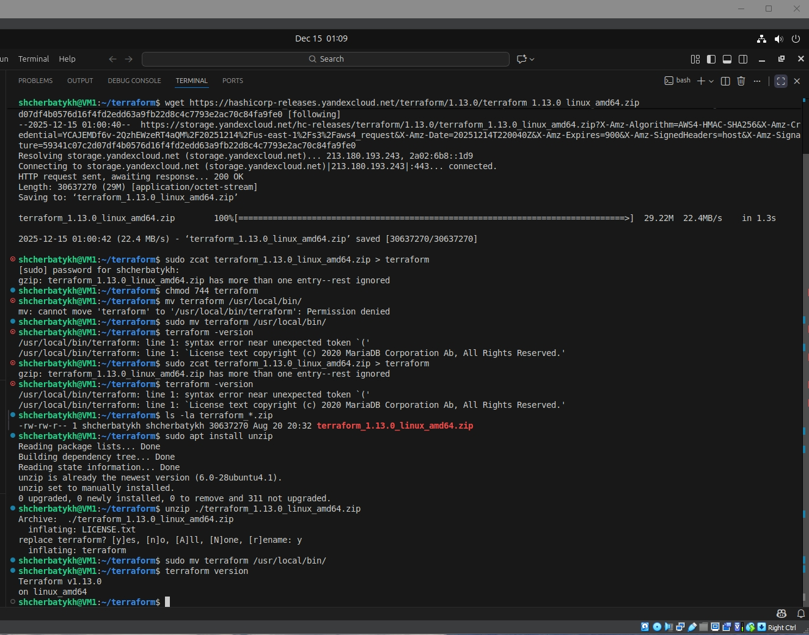

Создаю файл ```.terraformrc``` и добавляю блок с источником, из которого будет устанавливаться провайдер.
```bash
sudo nano /.terraformrc
```
```bash
provider_installation {
  network_mirror {
    url = "https://terraform-mirror.yandexcloud.net/"
    include = ["registry.terraform.io/*/*"]
  }
  direct {
    exclude = ["registry.terraform.io/*/*"]
  }
}
```

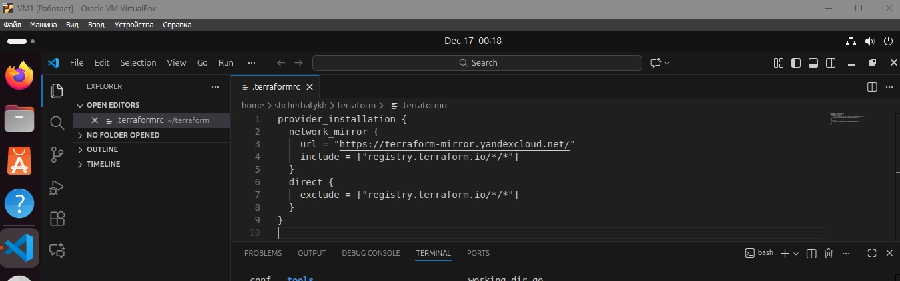

Для файла с метаданными, ```meta.yaml```, необходим публичный SSH-ключ для доступа к ВМ. Для Yandex Cloud рекомендуется использовать алгоритм Ed25519. Ссылка: https://cloud.yandex.ru/ru/docs/glossary/ssh-keygen
```bash
ssh-keygen
```
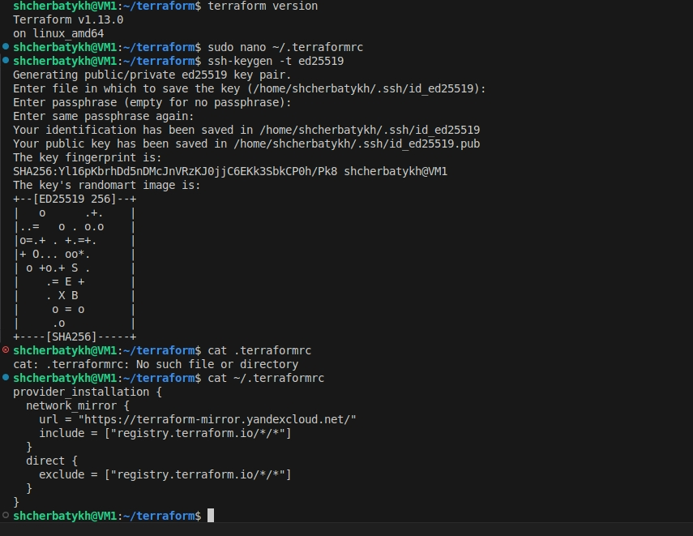

Создаю файл meta.yaml с данными пользователя на создаваемые ВМ.
```sudo nano ./meta.yaml```
```bash
#cloud-config
 users:
  - name: shcherbatykh
    groups: sudo
    shell: /bin/bash
    sudo: ['ALL=(ALL) NOPASSWD:ALL']
    ssh-authorized-keys:
      - course-project
```
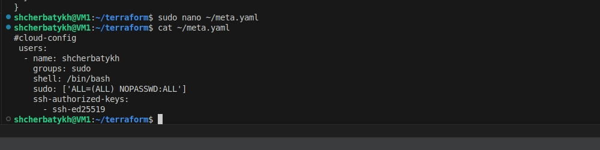

Создаю playbook Terraform c блоком провайдера.
```sudo nano ./main.tf```
```bash
terraform {
  required_providers {
    yandex = {
      source = "yandex-cloud/yandex"
    }
  }
  required_version = ">= 0.13"
}
```
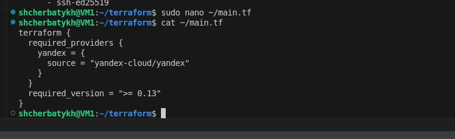

Инициализирую провайдера ```terraform init```

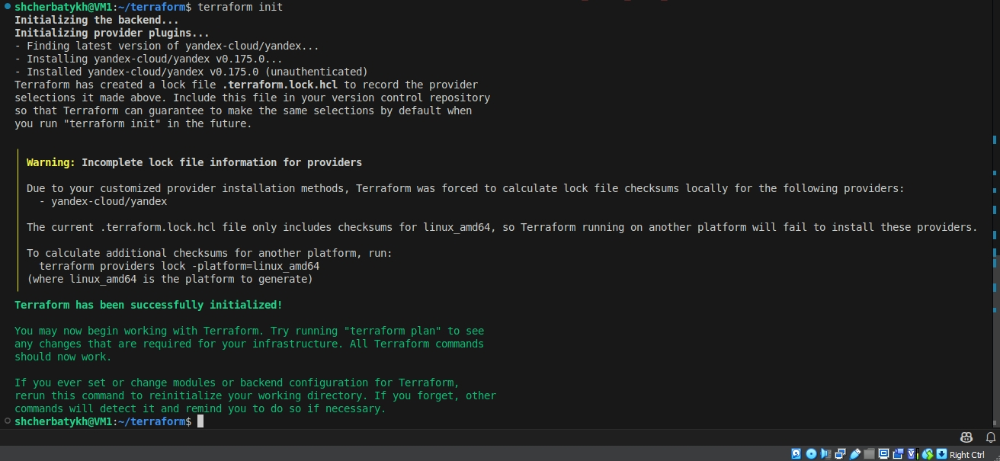

### Terraform готов к использованию.

### Установка и подготовка Ansible.

Устанавливаю Ansible и проверяю версию.

```bash
apt install ansible
ansible --version
```
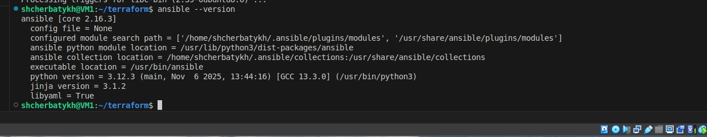

Создаю полностью прокомментированный пример ```ansible.cfg``` и заменяю содержимое файла на необходимые опции. Файл прикреплю отдельно.

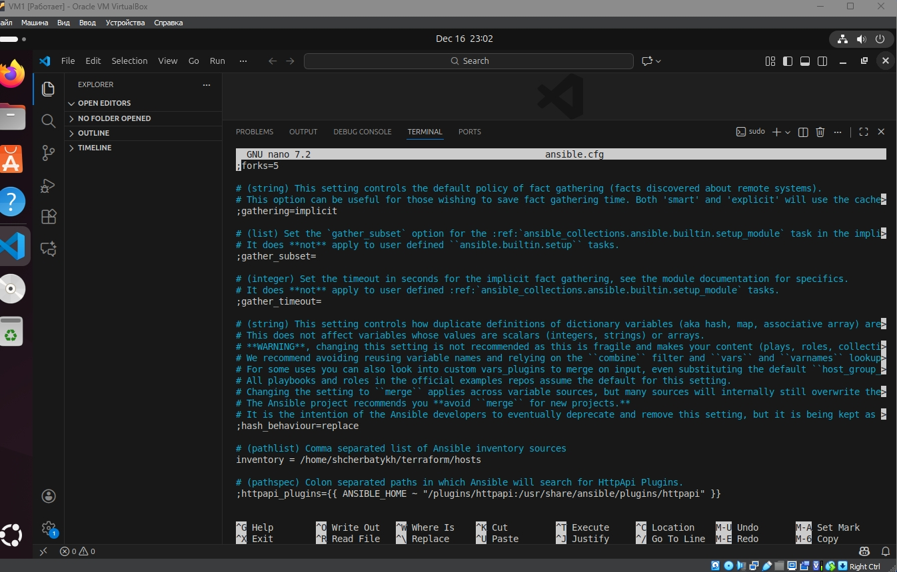

Создаю файл ```hosts``` и добавляю в него начальные данные. Файл прикреплю отдельно.

```bash
nano ./hosts
```
---

Заполнение конфигурационного файла terraform main.tf для выполнения задач дипломной работы.

Ссылки на файлы terraform:

[Файлы](https://github.com/Anton-Shcherbatykh/FOPS-32_coursework/tree/main/files%20terraform)

По условиям задачи необходимо развернуть через terraform следующий ресурcы:

**Сайт. Веб-сервера. Nginx.**

- Создать две ВМ в разных зонах, установить на них сервер nginx.
- Создать Target Group, включить в неё две созданные ВМ.
- Создать Backend Group, настроить backends на target group, ранее созданную. Настроить healthcheck на корень (/) и порт 80, протокол HTTP.
- Создать HTTP router. Путь указать — /, backend group — созданную ранее.
- Создать Application load balancer для распределения трафика на веб-сервера, созданные ранее. Указать HTTP router, созданный ранее, задать listener тип auto, порт 80.


**Мониторинг. Zabbix. Zabbix-agent.**

- Создать ВМ, развернуть на ней Zabbix. На каждую ВМ установить Zabbix Agent, настроить агенты на отправление метрик в Zabbix.


**Логи. Elasticsearch. Kibana. Filebeat.**

- Cоздать ВМ, развернуть на ней Elasticsearch. Установить Filebeat в ВМ к веб-серверам, настроить на отправку access.log, error.log nginx в Elasticsearch.
- Создать ВМ, развернуть на ней Kibana, сконфигурировать соединение с Elasticsearch.


**Сеть.**

- Развернуть один VPC.
- Сервера web, Elasticsearch поместить в приватные подсети.
- Сервера Zabbix, Kibana, application load balancer определить в публичную подсеть.
- Настроить Security Groups соответствующих сервисов на входящий трафик только к нужным портам.
- Настроить ВМ с публичным адресом, в которой будет открыт только один порт — ssh. Эта вм будет реализовывать концепцию bastion host.


**Резервное копирование.**

- Создать snapshot дисков всех ВМ.
- Ограничить время жизни snaphot в неделю.
- Сами snaphot настроить на ежедневное копирование.

---

#### Запуск terraform playbook.

```bash
terraform apply
```
Из-за неверно указанной при подготовке playbook зоны (не проверил, что на клауде зоны A, B и D) на "автомате" прописал в playbook зону C. Это вызвало ошибку при развёртывании. Скорректировал playbook и доразвернул всё корректно.

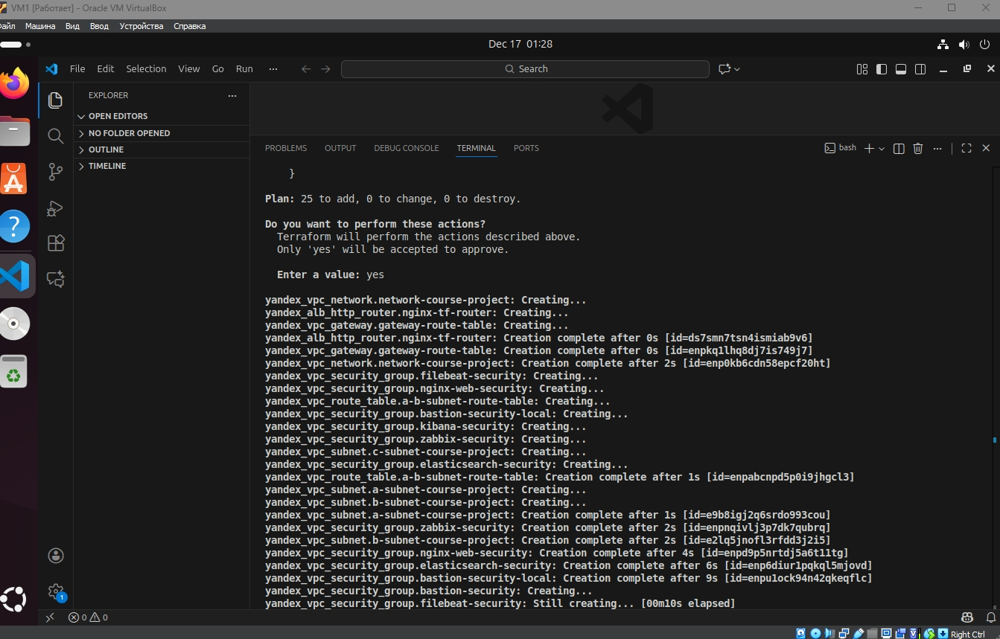
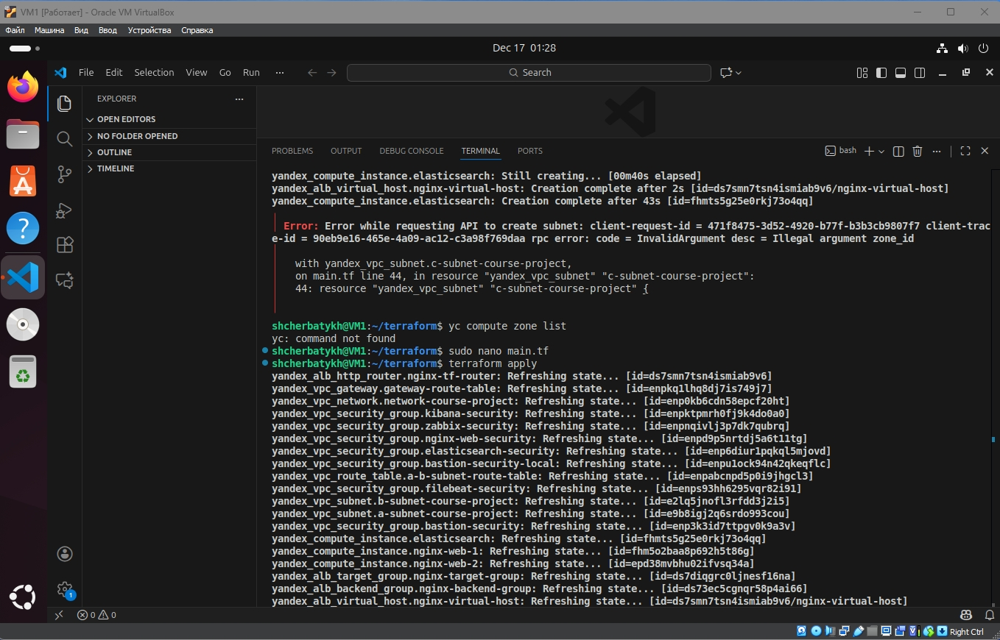


#### Проверка развернутых ресурсов в Yandex Cloud.

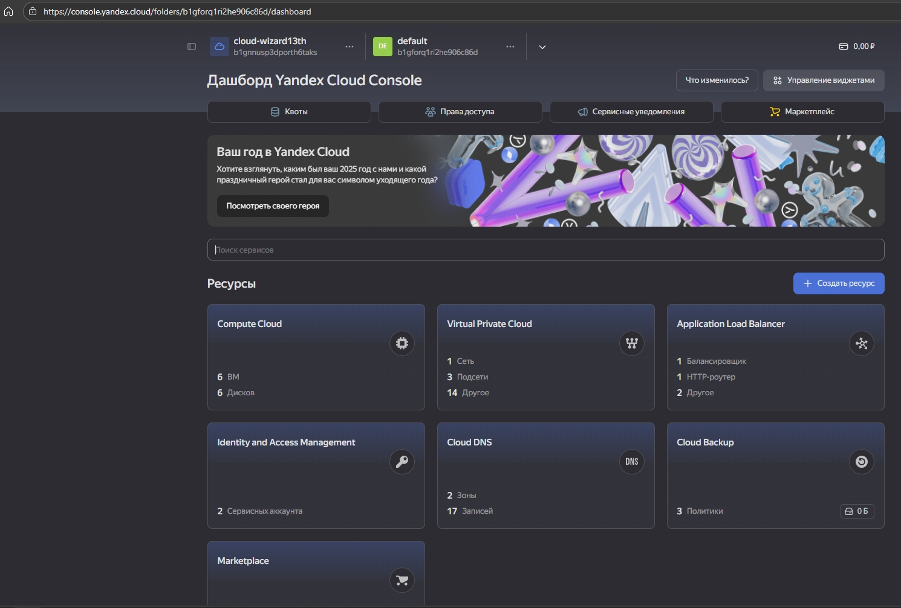
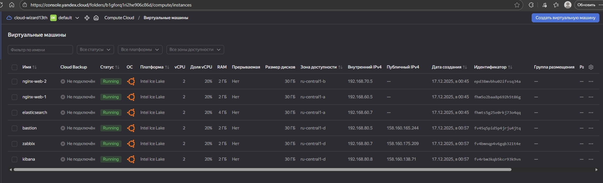
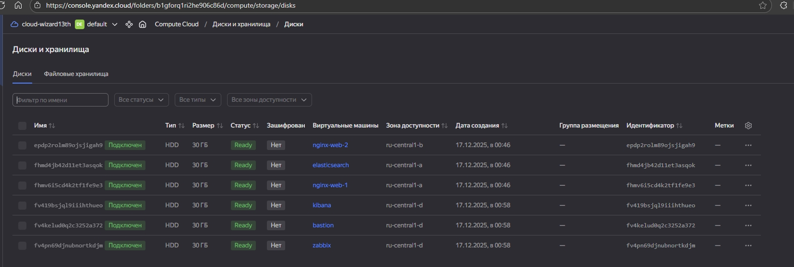
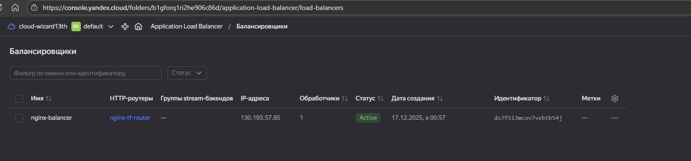
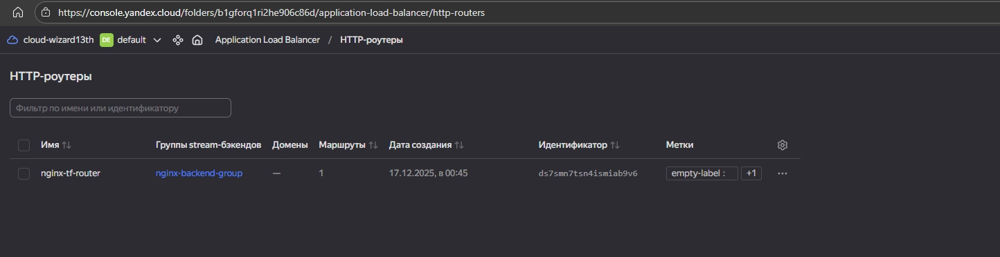
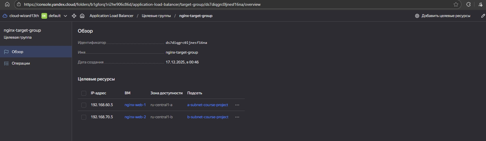
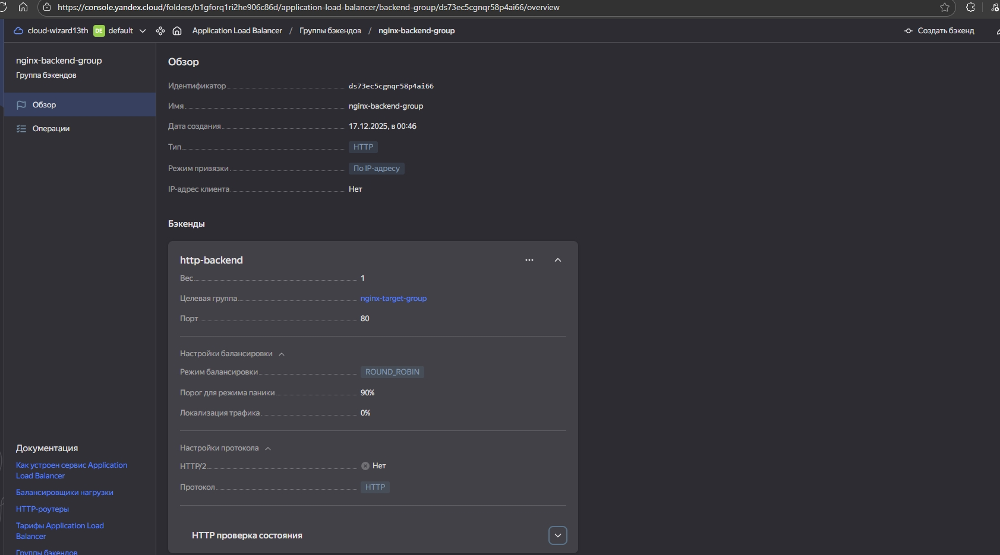
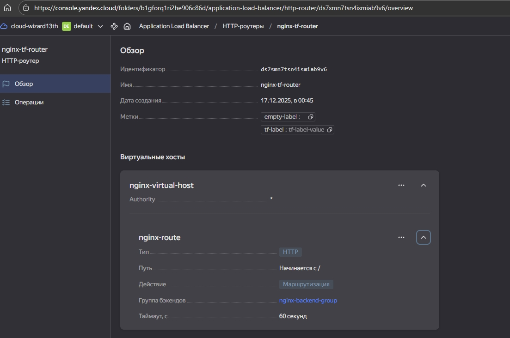
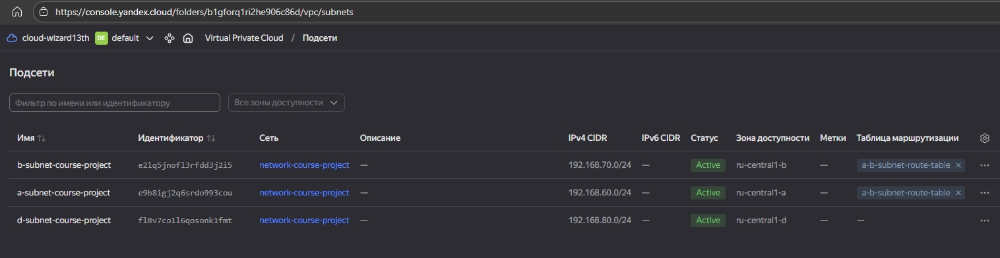
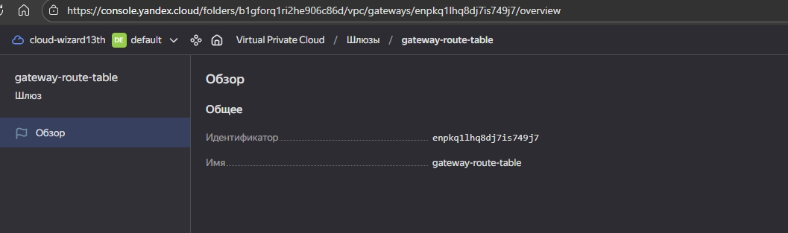
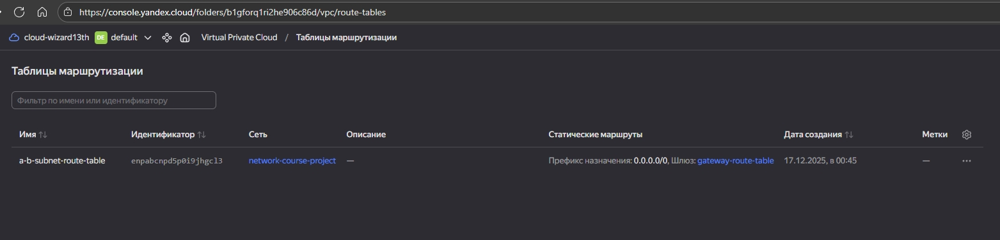
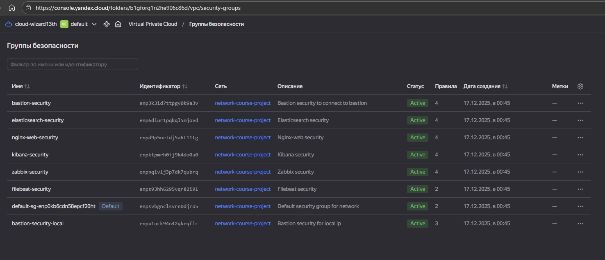
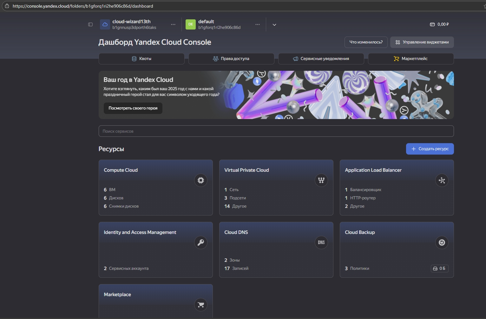
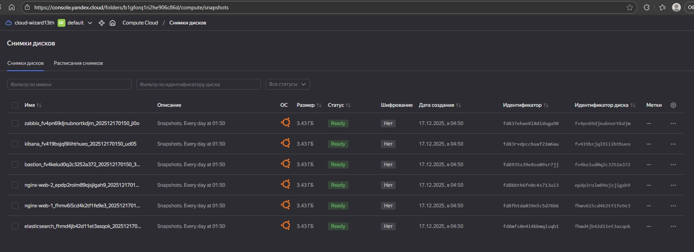

Все ресурсы через terraform развернуты и работают.

---

#### Заполнение конфигурационного файла ansible ```ansible.cfg``` и inventory ```hosts```

```ansible.cfg```. Указал следующие параметры.

```bash
[defaults]
inventory          = /home/shcherbatykh/hosts
host_key_checking  = False
remote_user        = shcherbatykh

[privilege_escalation]
become             = True
```

```hosts```. 

```bash
# ГРУППА для веб-серверов
[nginx_web]
nginx-web-1 ansible_host=192.168.60.5
nginx-web-2 ansible_host=192.168.70.5

# ГРУППА для бастион-хоста (для подключения извне)
[bastion]
bastion-host ansible_host=158.160.163.66

# ГРУППЫ для остальных сервисов
[monitoring]
zabbix ansible_host=192.168.80.7

[logging]
elasticsearch ansible_host=192.168.60.7
kibana ansible_host=192.168.80.8

# ОБЩИЕ ПЕРЕМЕННЫЕ для ВСЕХ хостов (кроме bastion)
[all:vars]
# Подключаемся от имени пользователя, созданного в cloud-config
ansible_user=shcherbatykh
# Указываем ПРИВАТНЫЙ ключ (файл БЕЗ расширения .pub)
ansible_ssh_private_key_file=/home/shcherbatykh/.ssh/project1
# Для подключения ко всем внутренним хостам используем ProxyJump через bastion
ansible_ssh_common_args='-o ProxyJump=shcherbatykh@158.160.163.66 -o StrictHostKeyChecking=no'
```

#### Мониторинг. Zabbix. Zabbix-agent.


