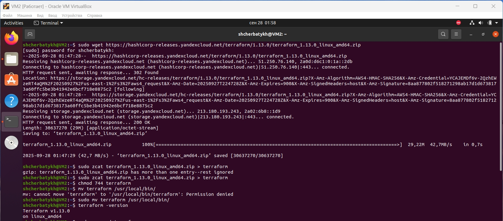
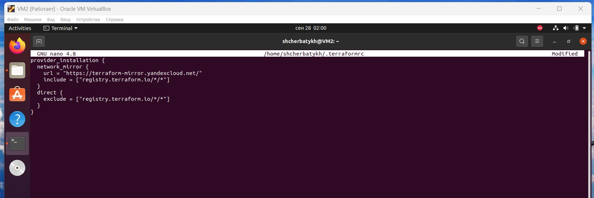
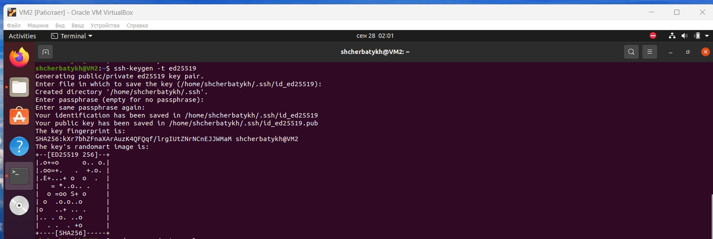
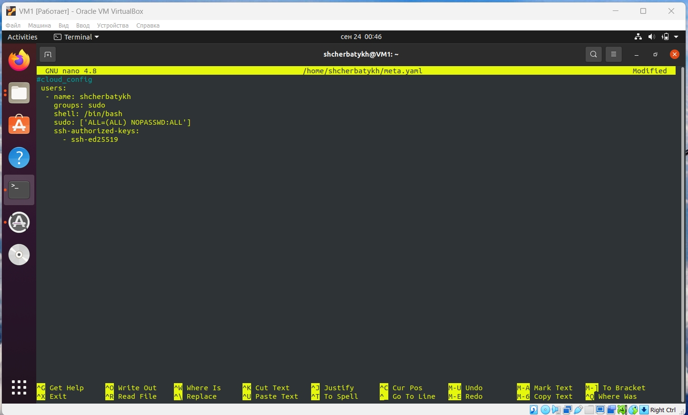
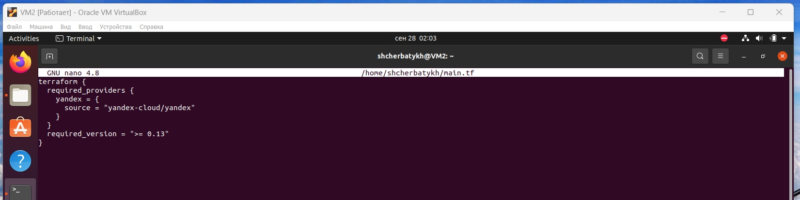
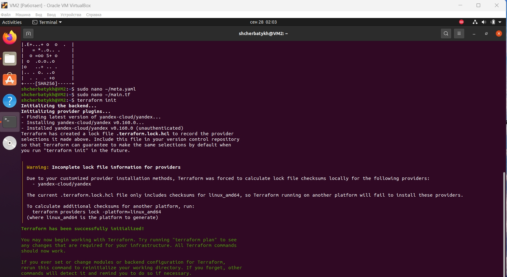

# FOPS-32_coursework
## Курсовой проект на профессии «DevOps-инженер с нуля»
### Установка и подготовка Terraform
Скачиваю и распаковываю последнюю стабильную версию на сентябрь 2025 г., с сайта: https://hashicorp-releases.yandexcloud.net/terraform/
```bash
wget https://hashicorp-releases.yandexcloud.net/terraform/1.13.0/terraform_1.13.0_linux_amd64.zip
zcat terraform_1.13.0_linux_amd64.zip > terraform
chmod 744 terraform
mv terraform /usr/local/bin/
terraform -version
```


Создаю файл ```.terraformrc``` и добавляю блок с источником, из которого будет устанавливаться провайдер.
```bash
sudo nano ~/.terraformrc
```
```bash
provider_installation {
  network_mirror {
    url = "https://terraform-mirror.yandexcloud.net/"
    include = ["registry.terraform.io/*/*"]
  }
  direct {
    exclude = ["registry.terraform.io/*/*"]
  }
}
```


Для файла с метаданными, ```meta.yaml```, необходим публичный SSH-ключ для доступа к ВМ. Для Yandex Cloud рекомендуется использовать алгоритм Ed25519. Ссылка: https://cloud.yandex.ru/ru/docs/glossary/ssh-keygen
```bash
ssh-keygen -t ed25519
```


Создаю файл meta.yaml с данными пользователя на создаваемые ВМ.
```sudo nano ~/meta.yaml```
```bash
#cloud-config
 users:
  - name: shcherbatykh
    groups: sudo
    shell: /bin/bash
    sudo: ['ALL=(ALL) NOPASSWD:ALL']
    ssh-authorized-keys:
      - ssh-ed25519
```


Создаю playbook Terraform c блоком провайдера.
```sudo nano ~/main.tf```
```bash
terraform {
  required_providers {
    yandex = {
      source = "yandex-cloud/yandex"
    }
  }
}
```


Инициализирую провайдера ```terraform init```



